# 轨迹封面（TrackCover）

一键打造两步路轨迹封面照片，无需抠图，超省心轻松出片。导入 KML/GPX 轨迹，自定义样式与标题，快速生成高颜值运动轨迹封面。

轨迹封面（TrackCover）是一款专注于轨迹可视化的工具，支持一键将轨迹文件加载到图片中，轻松制作专属轨迹封面。

- 支持主流 KML/GPX 格式轨迹文件导入
- 自由调整轨迹颜色、粗细等样式
- 可添加自定义标题，打造完整封面效果
- 操作简单，一键生成，适合运动、旅行、户外等场景使用

## 下载方式
App Store 搜索「轨迹封面」即可下载安装

## 使用指南

1. 导入轨迹文件
从设备中导入 GPX 或 KML 轨迹文件。
2. 自定义样式
调整轨迹颜色、粗细，并添加自定义标题。
3. 生成封面
点击生成按钮，制作专属轨迹封面。
4. 保存
将封面保存到相册，可分享使用。

## 联系我们
326663495@qq.com

---

Create beautiful track cover photos with just one tap. No cutting out needed, easy and efficient. Import KML/GPX tracks, customize styles and titles to generate stunning sports track covers quickly.

TrackCover is a tool dedicated to trajectory visualization. It allows you to load tracks into images with one click to create exclusive track covers.

- Import tracks in popular KML format
- Customize track style including color and thickness
- Add custom titles to complete your cover design
- Simple and intuitive operation, ideal for sports, travel and outdoor activities

## Download
Search "TrackCover" on the App Store to install.

## User Guide
1. Import Track File
Import a GPX or KML track file from your device.

2. Customize Style
Adjust track color, thickness and add your custom title.

3. Generate Cover
Tap the generate button to create your track cover.

4. Save
Save the cover to your photo album and share it.

## Contact Us
326663495@qq.com
---

## 截图/Screenshots

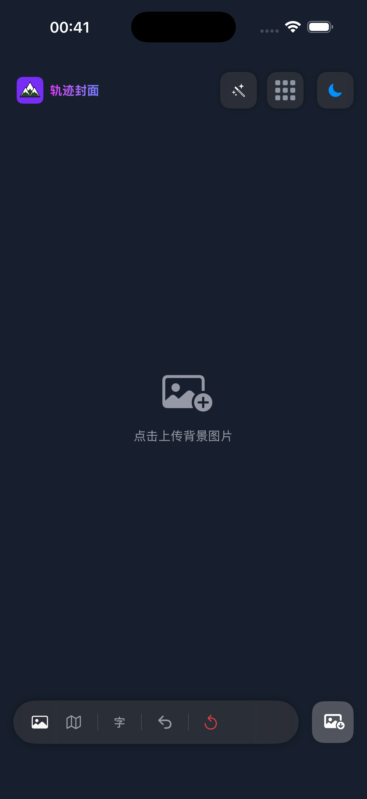
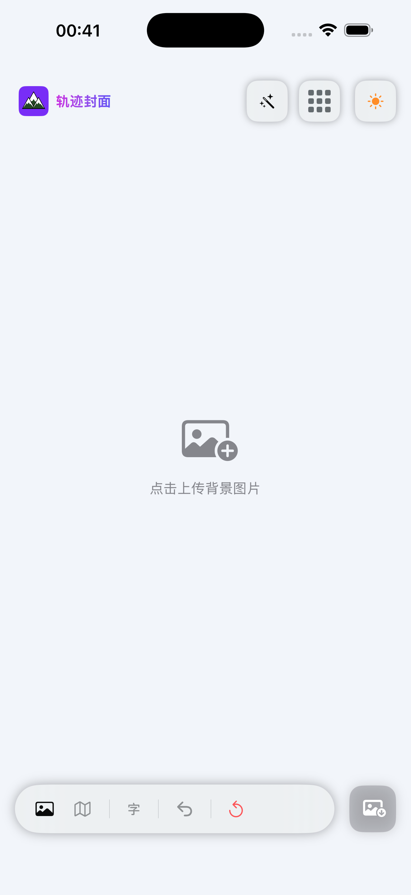
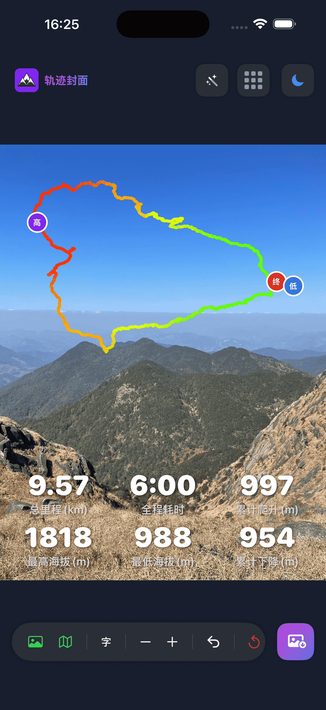
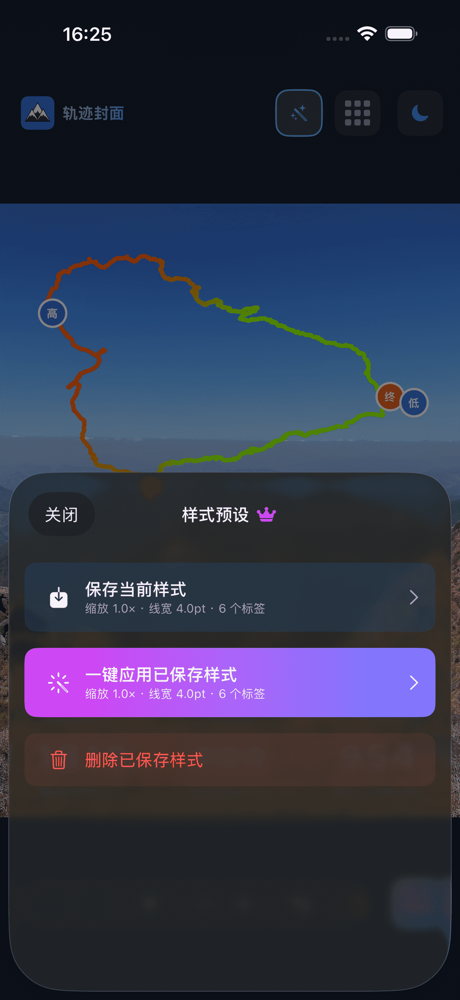
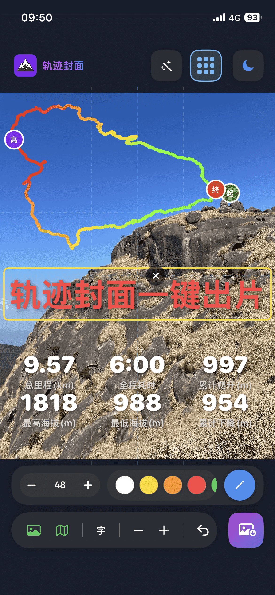
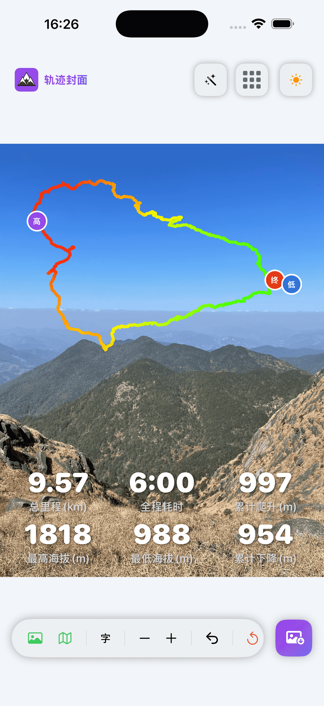
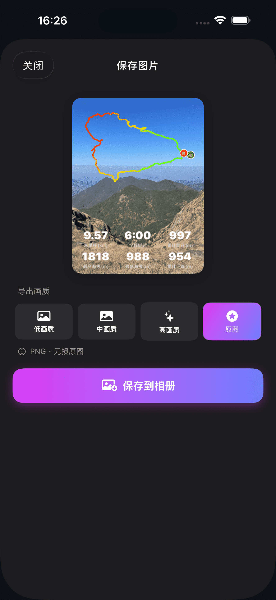
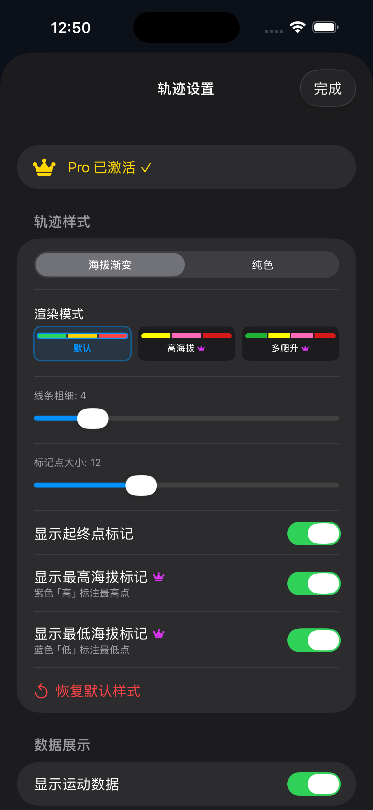

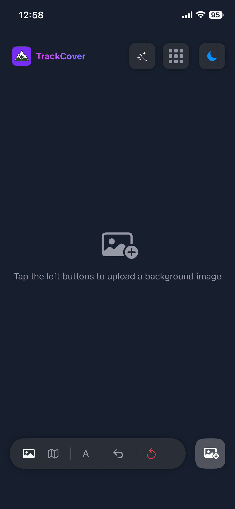

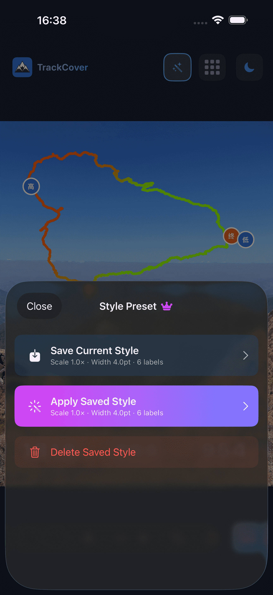
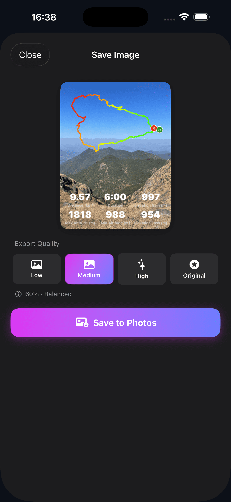
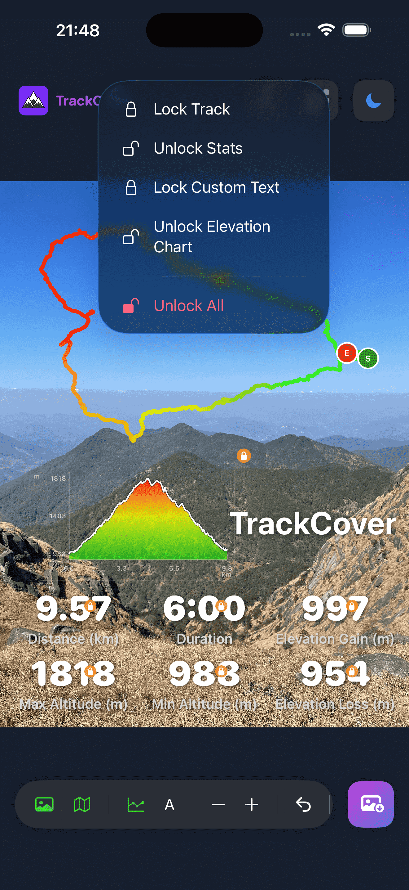
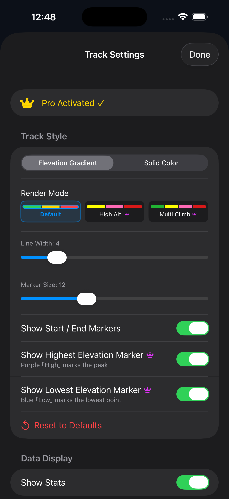

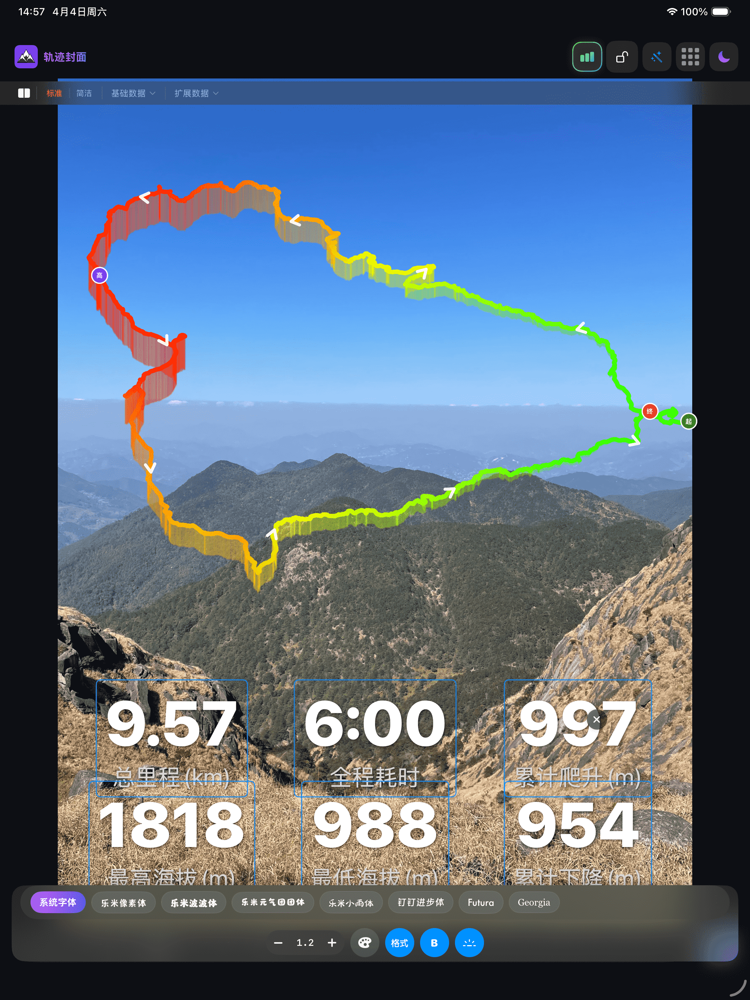
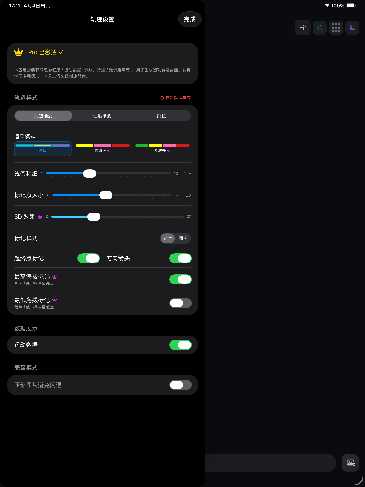
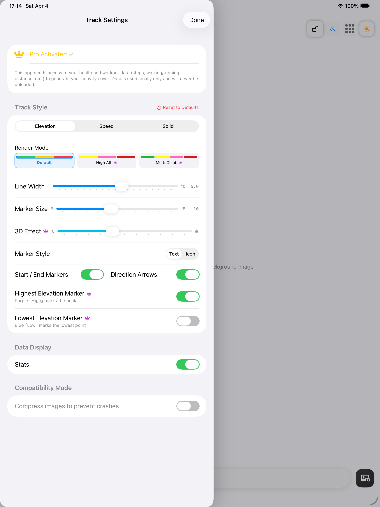
